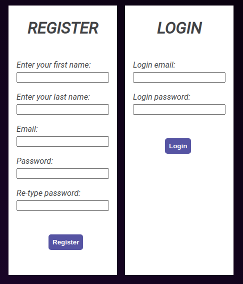

# LOGIN


## Getting Started
Login app, where it validates user name, email & password for special length. If all data is correct, it will write user info into db. The password is encrypted by bcrypt. Then you can login with your user credentials. Do so, you won't be disappointed !

## Reset
to reset db run next commands in console
```
rm db.sqlite3
mv db-copy.sqlite3 db.sqlite3
```

### Installing
must have pyton 3+, django 2.2.4+
```
pip3 install requirements.txt
```

## Built With
* Python
* Django

## Author
IURII LYTVYN

## License
Feel free to use it. This project is licensed under the MIT License - see the [LICENSE.md](LICENSE.md) file for details

